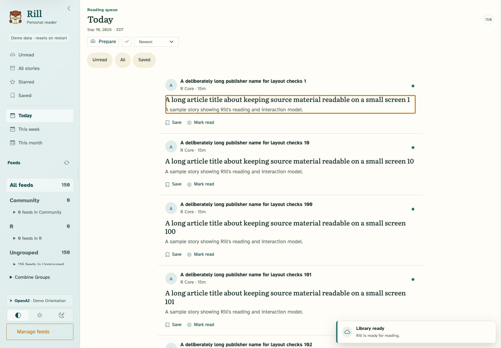

# Queue responsiveness verification

A deliberate left swipe now marks an unread story read on release, with server-confirmed Undo. Short drags and vertical scrolling leave its state unchanged. Already-read stories keep their explicit Mark unread button.

Selecting Today makes its date-filtered queue the main desktop surface. Return to Orientation and reopening the selected Today view both work. The existing local-midnight filter remains intact; timezone and daylight-saving contracts are covered by the R tests.

The queue starts with 30 cards and offers another 30 at a time within the existing 150-entry result limit. Each session caches its own rendered cards. Unchanged rows retain their DOM nodes, focus, and images; removing an unread story reindexes the remaining rows without rebuilding them.

## Local performance

The browser used the synthetic 150-story fixture. Five view switches took 79.4–170.2 ms from the view change to the browser's render acknowledgement, with a median of 96.2 ms. Responsive browser checks ran concurrently. See [raw timings](verification.json).

| Render benchmark | Median |
| --- | ---: |
| Previous full 150-card render | 778 ms |
| New first 30-card batch | 93 ms |
| Reusing the 30 cached cards | 7 ms |

Initial card HTML dropped from 520,043 to 107,456 bytes. The benchmark deliberately compares the old full initial list with the new smaller first batch. See [baseline data](baseline-render.json), [current data](current-render.json), and `scripts/browser/benchmark-queue.R` for reproduction.

These measurements are local, not production results. Hosted performance remains to be verified after deployment. The new content-free `queue.view` trace correlates the request, query, card render, server flush, and browser acknowledgement, with view, row counts, and calendar context, so the hosted change can be verified after deployment.

## Behavior and checks

- Desktop: Today/All/Unread switching, 30-to-60 load more, preserved row identity, Save, read removal and reindexing, Undo, skip-link focus, and opening an article from the expanded queue passed.
- Touch: 80-pixel left swipe commits without another tap; 30-pixel drag and vertical scrolling do not. Undo restores the story.
- Responsive: 320, 390, 430, 768, and 1440 pixels, plus dark mode and enlarged text, passed with no horizontal overflow or axe violations. Browser error logs were empty. See [responsive results](timeline/results.json).
- Direct full R suite with PostgreSQL: 3,455 passing assertions, no failures, warnings, or skips. The final installed-package server sequence, including request validation, passed 636 assertions.
- Final R CMD check: **0 errors, 0 warnings, 0 notes**. Its tests passed 3,437 assertions; four deployment-file tests were skipped because those files are intentionally excluded from the built package. PostgreSQL contracts ran. See [package check](package-check.log) and [packaged test results](package-tests.log).
- Package documentation index and JavaScript syntax checks passed.

Implementation checkout: `/private/tmp/rill-queue-responsiveness-20260910`, branch `codex/queue-responsiveness-20260910`, based on `694ef613ec3c274b7cc355d45de521e0b0161bbf`.

## PR review regression checks

`node scripts/browser/queue-review.mjs` verifies actual Next/Previous buttons, keyboard navigation, and native Chromium phone swipes across batch boundaries. Pending navigation is cancelled when the reader changes direction; Next is disabled only at the end of the full queue. Keyboard focus remains on Show more until the final batch, then moves to the first newly loaded story. The same suite checks a null active element, missing and throwing crypto APIs, and a missing server acknowledgement: the queue becomes usable again after 15 seconds. The checks use synthetic local data and report no browser errors.
